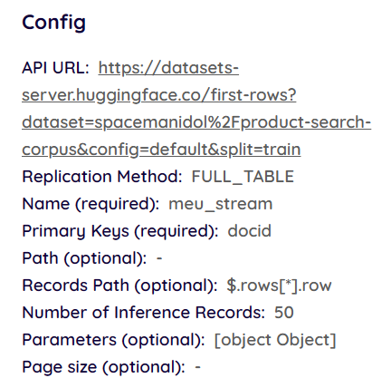
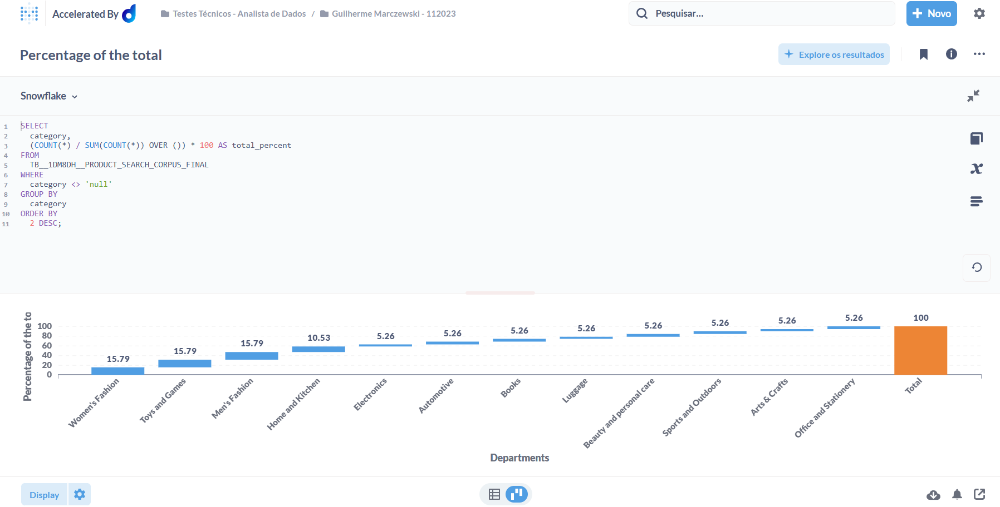
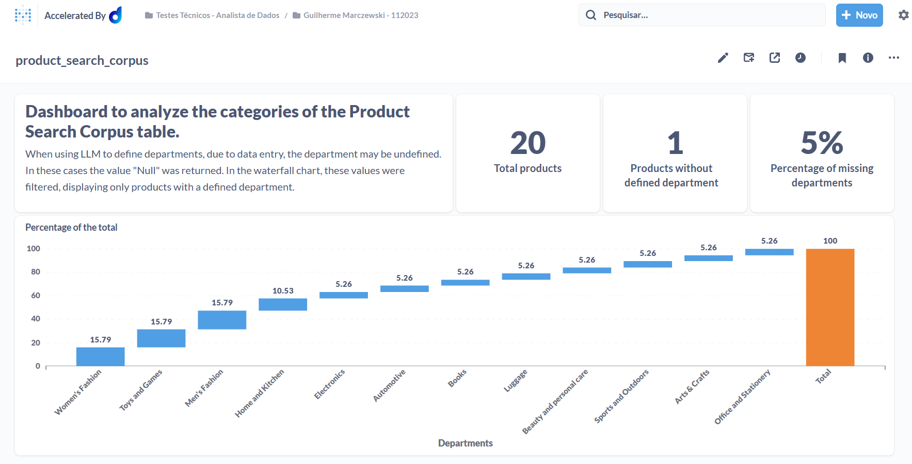
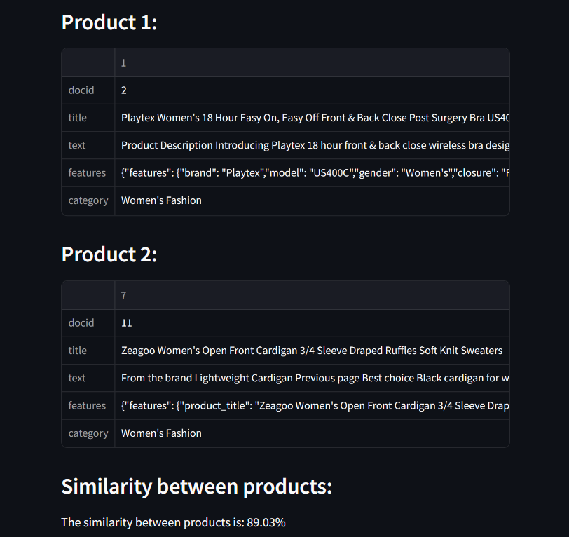
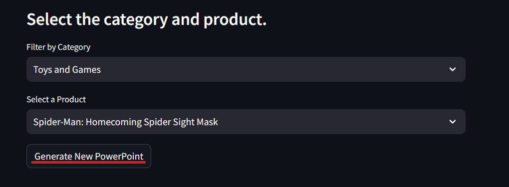
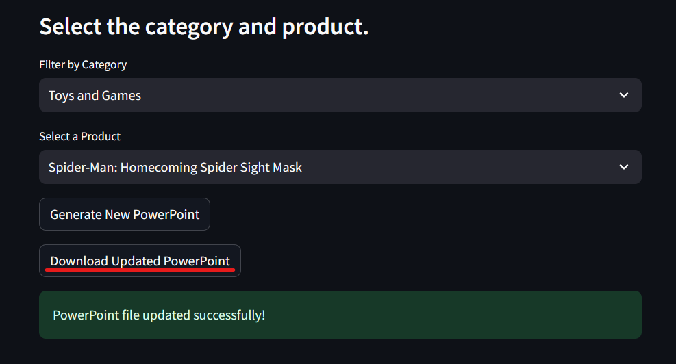
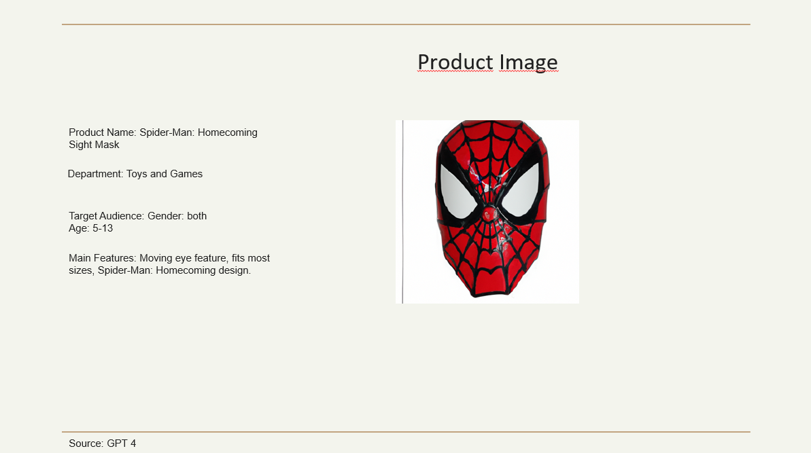
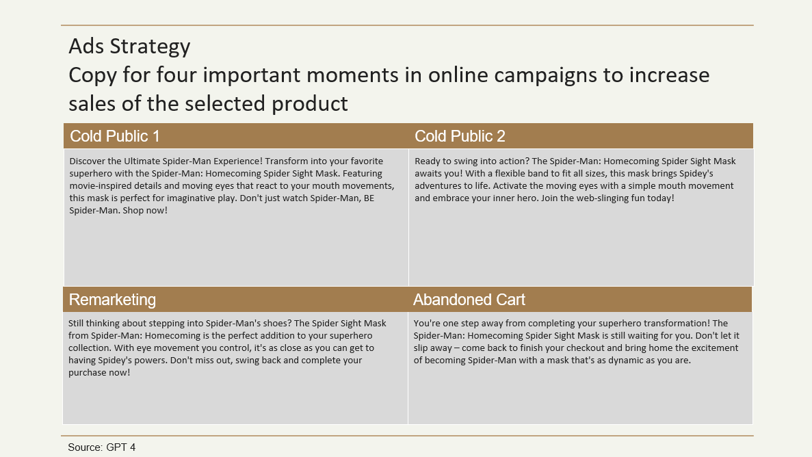

# GUILHERME_MARCZEWSKI_DDF_DATAANALYST_112023

## Item 1 - Sobre Storytelling e Apresentação

## Item  2 - Sobre a Dadosfera

Para importação do arquivo disponibilizado no [Hugging Face](https://huggingface.co/datasets/spacemanidol/product-search-corpus/viewer/default/train?row=0) foi criada uma pipeline utilizando como source o conector REST API, com as seguintes configurações para extrair os campos solicitados:

Após o carregamento do dataset, foi criado o seguinte [Data Catalog](https://app.dadosfera.ai/en-US/catalog/data-assets/42d36163-e861-4b6a-aa94-d8144fbb6414).

## Item 3 - Sobre GenAI e LLMs

Para criação das features do produtos do dataset, extraídas do campo text, foi utilizada a API da OpenAI.

O processo completo para extração e tratamento dos dados está nesse [Jupyter Notebook](https://github.com/guimarczewski/GUILHERME_MARCZEWSKI_DDF_DATAANALYST_112023/blob/main/spacemanidol_product_search_corpus.ipynb).

## Item  4 - Sobre SQL e Python

Para trabalharmos com as features extraída com o uso da API do OpenAI dentro da dadosfera, os dados foram importados manualmente em um arquivo CSV. O arquivo está disponível na [Dadosfera](https://app.dadosfera.ai/en-US/collect/import-files/90d671f3-2370-4dee-bf19-6a091df354d7).

Após isso acessamos os dados através do Metabase, e salvamos as consultas e visuais dentro da coleção [Testes Técnicos - Analista de Dados/Guilherme Marczewski - 112023](https://metabase-treinamentos.dadosfera.ai/collection/290-guilherme-marczewski-112023).

Com isso foi criado um Dashboard para análise dos departamentos dos produtos, disponibilizado na
[Dadosfera](https://metabase-treinamentos.dadosfera.ai/dashboard/66-product-search-corpus).

## Item  5 - Sobre Data Apps

O Data App criado para esse projeto, feito com o Streamlit, verifica a similaridade entre os produtos selecionados. Quanto maior o valor da similaridade, mais similares os produtos são.

O aplicativo utiliza spaCy, uma biblioteca de processamento de linguagem natural, para calcular a semelhança entre os recursos processados dos produtos selecionados. Isso envolve representar as características de cada produto como um vetor e medir a similaridade entre esses vetores.

O App está hospedado tanto na [Dadosfera](https://app-intelligence-treinamentos.dadosfera.ai/pbp-service-streamlit-c14c6038-7d28-48f094bd0f19-ee8b-4021_8501/) quando no [Streamlit.io](https://similarity-ddfr.streamlit.app/)

## Item Bonus - Sobre GenAI + Data Apps

Para esse projeto foi criado o Data App, também com o uso de streamlit, para gerar automaticamente uma apresentação em Power Point para o produto selecionado.

O App está hospedado tanto na [Dadosfera](https://app-intelligence-treinamentos.dadosfera.ai/pbp-service-streamlit-bfc86fce-0023-42efc92cc443-7e43-4dc5_8501/) quando no [Streamlit.io](https://generate-presentation.streamlit.app/)

Além dos textos da apresentação, também é gerada uma imagem do produto, ambas utilizando a API da OpenAI.

A apresentação é feita com base em um modelo, que está no path "streamlit_presentation/template.pptx".

Um exemplo do resultado do App está no arquivo salvo em "streamlit_presentation/updated_ppt.pptx".

Segue uma breve explicação do conteúdo de cada slide:

Slide 1: Nome do produto de forma resumida.

Slide 2: Nome do produto, departamento, público alvo de acordo com as features e principais features.
Nesse slide também está presente a imagem gerada com o uso da API do Dall-e.

Slide 3: Copys para anúncios online geradas pela API da OpenAI. Duas copys são para públicos frios, tendo os primeiros contatos online com o produtos. Uma copy para remarketing, quando o cliente já interagiu com o produto ou o seu link de compra. Uma copy para clientes que iniciaram o processo de compra mas não finalizaram.

Slide4: Slide de agradecimento.

